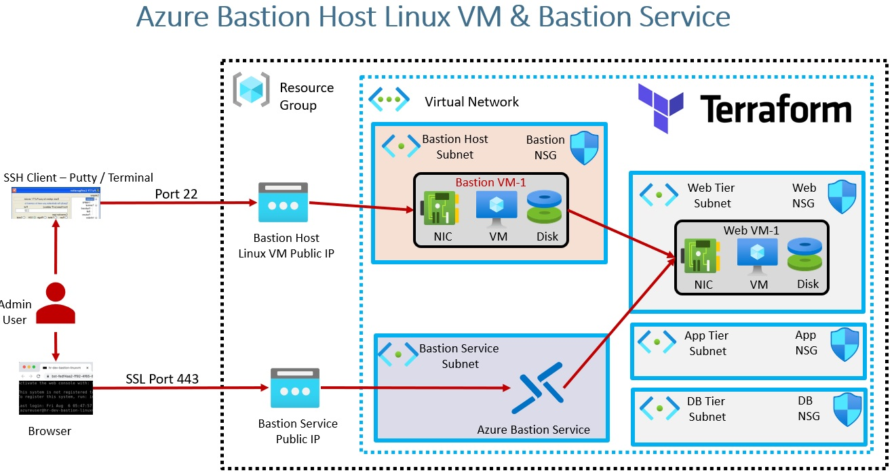
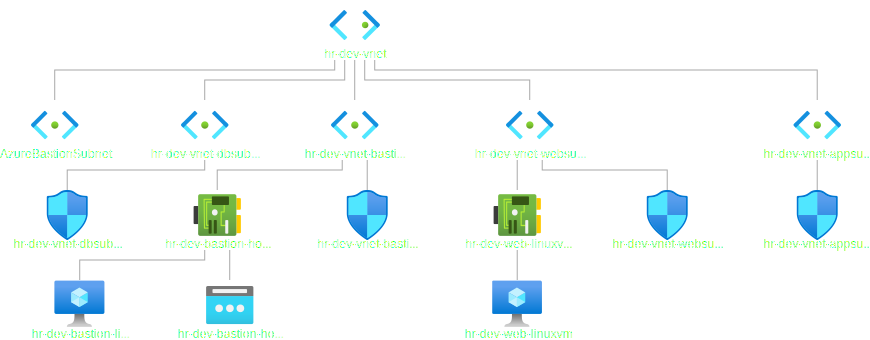
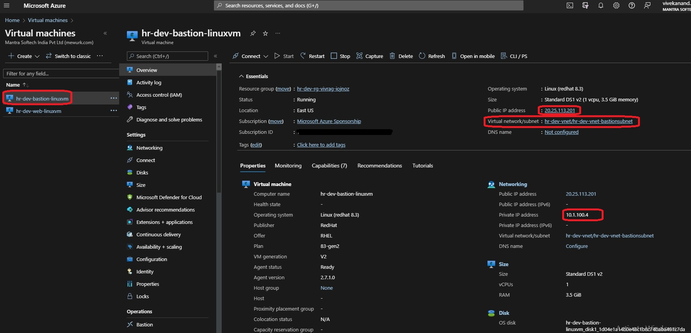
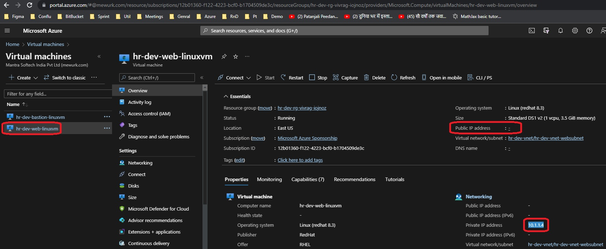
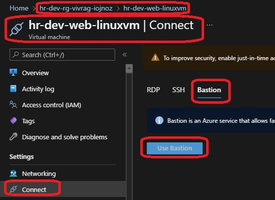
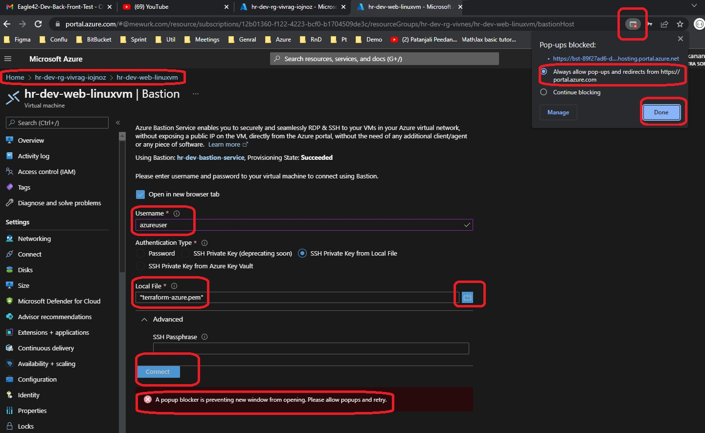
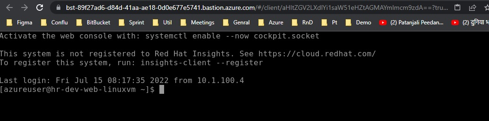

# Bastion Service

## Bastion Host: Linux VM
## Bastion Service: Azure Bastion Service

- Azure Bastion is a fully managed service that provides more secure and seamless Remote Desktop Protocol (RDP) and Secure Shell Protocol (SSH) access to virtual machines (VMs) without any exposure through public IP addresses. Provision the service directly in your local or peered virtual network to get support for all the VMs within it.

- Reference: https://azure.microsoft.com/en-us/services/azure-bastion/#overview

 
- One VM can be associated with multiple VM Network Interfaces. So the following is a list.
network_interface_ids = [azurerm_network_interface.web_linuxvm_nic.id]

- The following is the diagram downloaded from the Azure Portal.

- The bastion linux vm. 

- The web linux vm.Note that it has no public ip address. Only the private ip address.

- Connect to Web VM via Bastion from the auzre portal. Go to the resource group on portal. Click on the web linux vm. Click on the Connect button. Then select Bastion tab. Then click Use Bastion button. 

- Provide user name as azueruser and browse ssh key. Click connect. Take care of the pop up blocker.  

- Bastion console is not infront of you. 

- You can connect to bastion vm as well in a similar manner.

