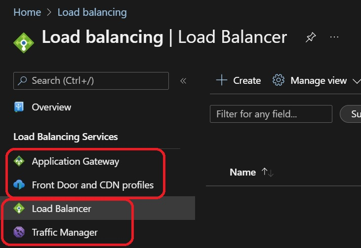

# Standard Load Balancer with two Vms

1. Create Resource Group with name slb-demo1-rg.
2. Create a Vnet with name slb-demo1-vnet.
3. Create a Subnet with name slb-demo1-subnet.
4. Create 2 VMs with name slb-demo1-vm1 and slb-demo1-vm2.
5. Create Key Pair with name slb-demo1-ssh-key-pair.
6. Create Standard Load Balancer with name slb-demo1-slb.
7. slb-demo1-slb-fip
8. slb-demo1-slb-fip-pip
9. slb-demo1-slb-backend-pool
10. slb-demo1-slb-health-probe
11. slb-demo1-slb-load-balancing-rule
12. slb-demo1-slb-1022-nat1, slb-demo1-slb-2022-nat2

- 4 kinds of load balancers. They are classified into two groups. The bottom two comes under layer 4 load balancer. Tcp Udp load balancers.

