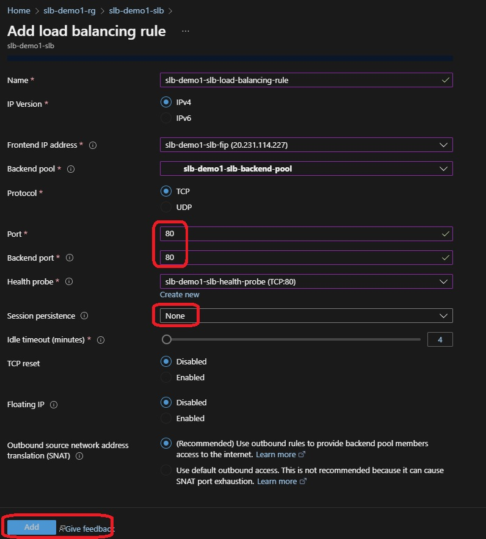

# Standard Load Balancer with two Vms

- Create Resource Group with name slb-demo1-rg.

- Create a Vnet with name slb-demo1-vnet.

- Create a Subnet with name slb-demo1-subnet.

- Create 2 VMs with name slb-demo1-vm1 and slb-demo1-vm2.

- Create SSH Keys as well. Create Key Pair with name slb-demo1-ssh-key-pair.

- For Disk size, just take the defaults.

- Networking

- 4 kinds of load balancers. They are classified into two groups. The bottom two comes under layer 4 load balancer. Tcp Udp load balancers.

- Create Standard Load Balancer.

- Frontend IP Configuration

- Backend Pool

- Backend Pool options

- Now Health Probes

- Add Health Probes

- Add Load Balancer Rules

- Load Balancer Rules Options

- NAT Rules 

- NAT Rules 

- NAT Rules 

7. slb-demo1-slb-fip
8. slb-demo1-slb-fip-pip
9. slb-demo1-slb-backend-pool
10. slb-demo1-slb-health-probe
11. slb-demo1-slb-load-balancing-rule
12. slb-demo1-slb-1022-nat1, slb-demo1-slb-2022-nat2

