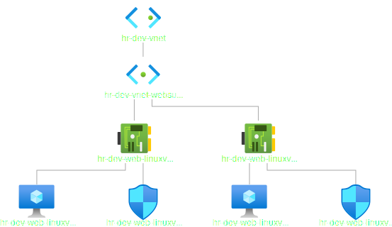

# Standard Load Balancer with Terraform

- This example is step towards buiding the load balancer example built earlier manually. But using terraform.

- This example is built on top of the [`iac-23001100-std-load-bal-manual`](https://github.com/AvtsVivek/AzureWithTerraformAdvanced/tree/main/iac/23001000-std-load-bal-manual) example.

- In this example, resource group, vnet along with subnet, and vm are created using terraform.

- Standard load balancer is added in a subsequent exercise.

- What is achieved is the following. Here we are creating two vms.

