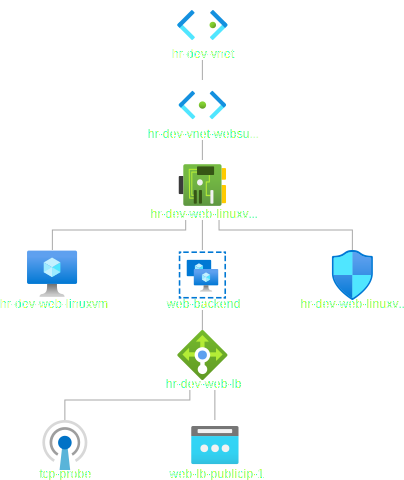

# Standard Load Balancer with Terraform

- This example is step towards buiding the load balancer example built earlier manually. But using terraform.

- This example is built on top of the [`iac-23001000-std-load-bal-manual`](https://github.com/AvtsVivek/AzureWithTerraformAdvanced/tree/main/iac/23001000-std-load-bal-manual) example.

- This builds on [the earlier 23001100-std-load-bal-vm-terraform](https://github.com/AvtsVivek/AzureWithTerraformAdvanced/tree/main/iac/23001100-std-load-bal-vm-terraform)

- In this example, resource group, vnet along with subnet, and vm are created using terraform.

- Standard load balancer is added is also added in this exercise.

- What is achieved is the following.

- Load Balancer topology is as follows.

- Nat Rules are not added at this point. They will be added subsequently.

