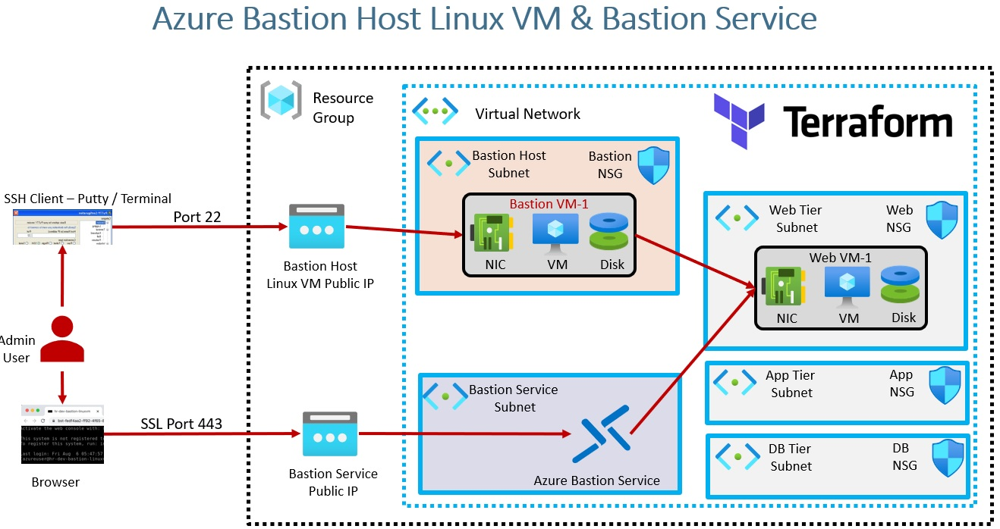
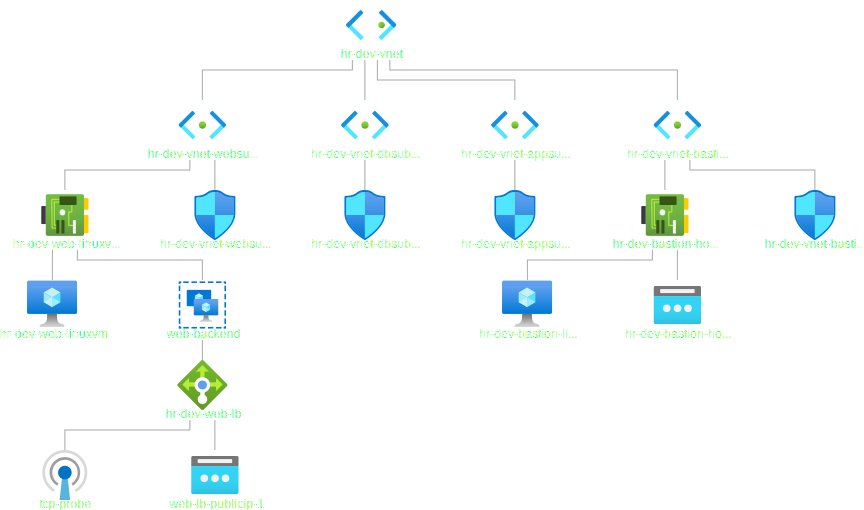

# Bastion Service

## Bastion Host: Linux VM
## Bastion Service: Azure Bastion Service

- Azure Bastion is a fully managed service that provides more secure and seamless Remote Desktop Protocol (RDP) and Secure Shell Protocol (SSH) access to virtual machines (VMs) without any exposure through public IP addresses. Provision the service directly in your local or peered virtual network to get support for all the VMs within it.

- In this tutorial, we will provision a bastion host. Azure Bastion Service is not provisioned. So this is commented out.

- Reference: https://azure.microsoft.com/en-us/services/azure-bastion/#overview

 
- One VM can be associated with multiple VM Network Interfaces. So the following is a list.
network_interface_ids = [azurerm_network_interface.web_linuxvm_nic.id]

- The following is the diagram downloaded from the Azure Portal, Vnet

- Load Balancer Topology is as follows.

