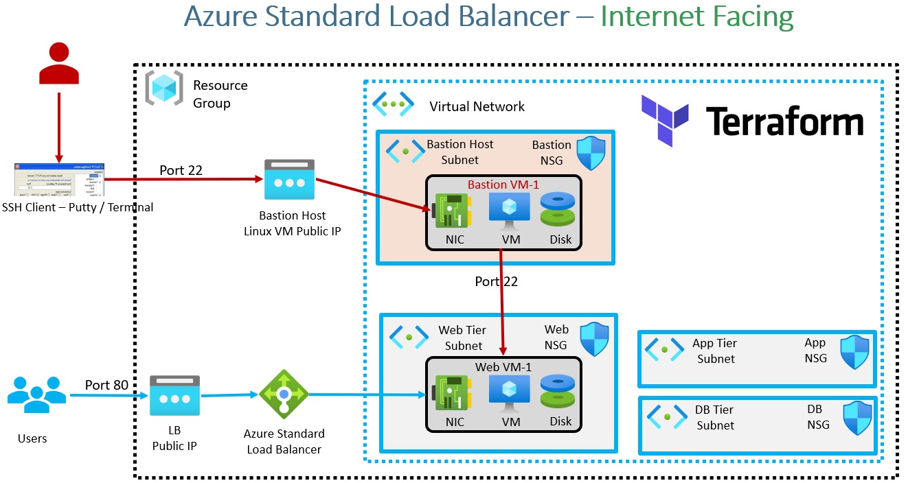
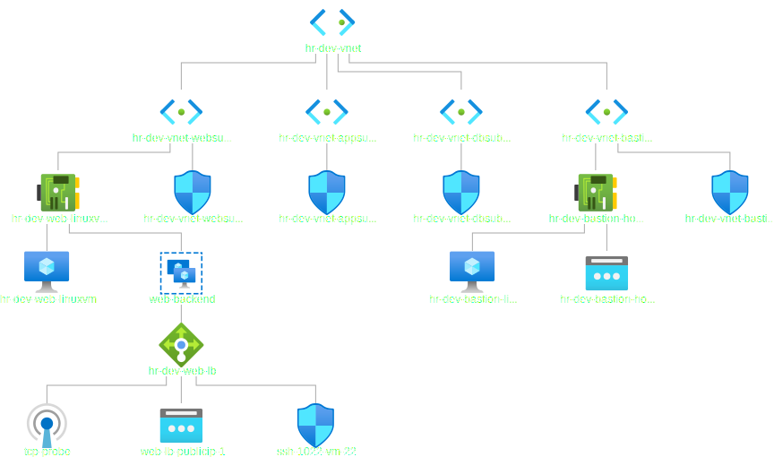
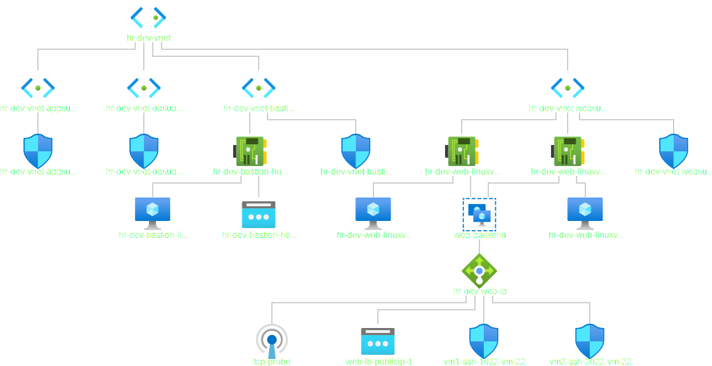

# Bastion Service

## Bastion Host: Linux VM
## Mutiple VMs: Yes

- Azure Bastion is a fully managed service that provides more secure and seamless Remote Desktop Protocol (RDP) and Secure Shell Protocol (SSH) access to virtual machines (VMs) without any exposure through public IP addresses. Provision the service directly in your local or peered virtual network to get support for all the VMs within it.

- Azure Bastion Service is not provisioned. So this is commented out(look at tf8-04-AzureBastionService.tf, this is totally commented out).

- Reference: https://azure.microsoft.com/en-us/services/azure-bastion/#overview

- In this tute, We will add NAT rules to the ones we bult earlier.
 
- One VM can be associated with multiple VM Network Interfaces. So the following is a list.
network_interface_ids = [azurerm_network_interface.web_linuxvm_nic.id]

# The following needs to be changed.

- The following is the diagram downloaded from the Azure Portal, Vnet

- Load Balancer Topology is as follows.

- The following is the vnet diagram with two Vms.

 
- The following is the diagram of load balancer with two Vms.

### Additional Note for reference
1. Meta-Argument count - Terraform Function element()
2. Meta-Argument for_each with maps - Terraform Function lookup()

