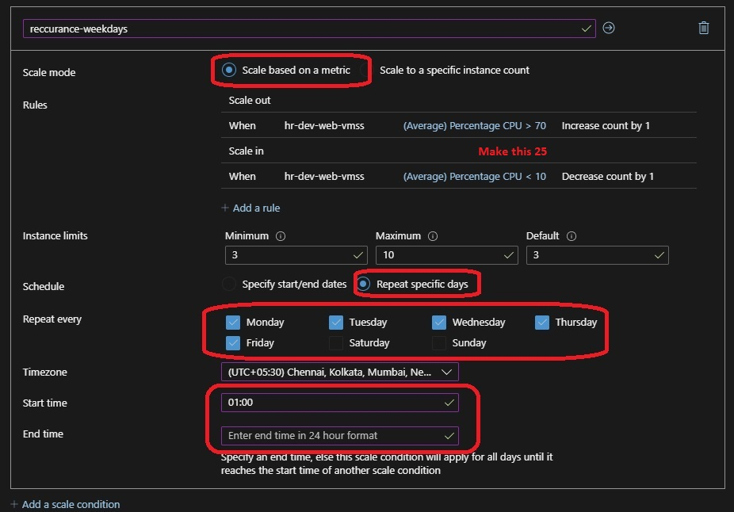

# Auto Scaling of Azure Virtual Machines Scale Set

## ntro

- In this tute, we change the scaling to Auto. We will build on the previous tutorial.

## Autosaling default profile

- Defaults to round the clock schedule

- Mandatory Profile

- Will not execute if Recurrence or Fixed Profile exists

## Autosaling Recurrence profile

- Recur on those days with start time specified

- Week Day  and Weekend profiles

- Business Hour and Non-Business Hour profile

## Autosaling Fixed profile

- Executes on that specific day

- Fixed profile takes priority 1 for execution on that day if exists

## Priority

- Priority Execution Order for Autoscaling Profiles is as follows

    - Autoscaling Fixed Profile
    - Autoscaling Recurrence Profile
    - Autoscaling Default Profile

- The layout

- The following is the Manual scale config

- Changing that to Auto scale config

- Add Rule

- Out and in rules

- Available Memory bytes

- Add Rule SYN Count 

- Add Rule SYN Count

- Add Rule

- Out and in rules

- Out and in rules

- Reccurance Weekdays

- Similarly for Weekend

- Now Fixed profle 

- The following is the diagram downloaded from the Azure Portal, Vnet

### Additional Note for reference
1. Meta-Argument count - Terraform Function element()
2. Meta-Argument for_each with maps - Terraform Function lookup()

