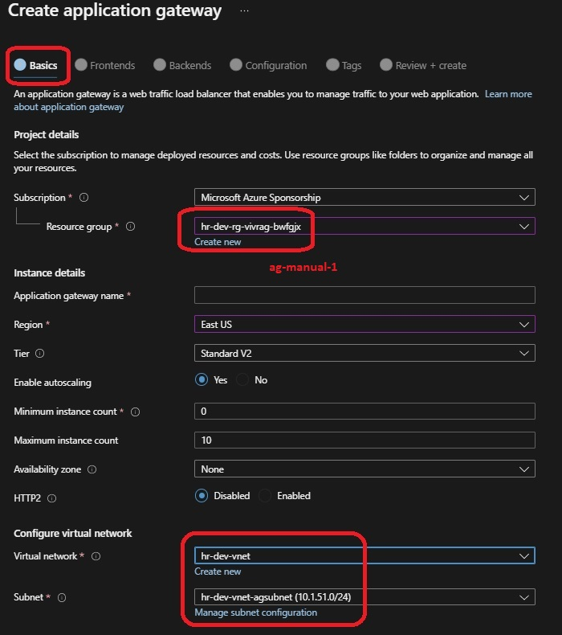

## Azure Gateway

 - This example builds from [23009000-vm-auto-scale-tf-fixed](https://github.com/AvtsVivek/AzureWithTerraformAdvanced/tree/main/iac/23009000-vm-auto-scale-tf-fixed)

- Adds an additional subnet(for azure gateway) to the existing VNet.

# Now creating Application Gateway from portal.

- Azure App GateWay

- Azure App GateWay Components

2

3

4

5

6

7

8

9

10

Http Probe

Http Probe test

Monitoring

Ag Topology

 - Get the public IP address of the App Gateway.

http://23.96.9.202/app1/index.html

http://23.96.9.202/app1/hostname.html

http://23.96.9.202/app1/status.html

http://23.96.9.202/app1/meatadata.html

## Deleting the App Gateway

- Delete the public IP address of the App Gateway.

- Disassociate the backend pools from the App Gateway. Ensure the targets are 0

Ensure targests are zero

