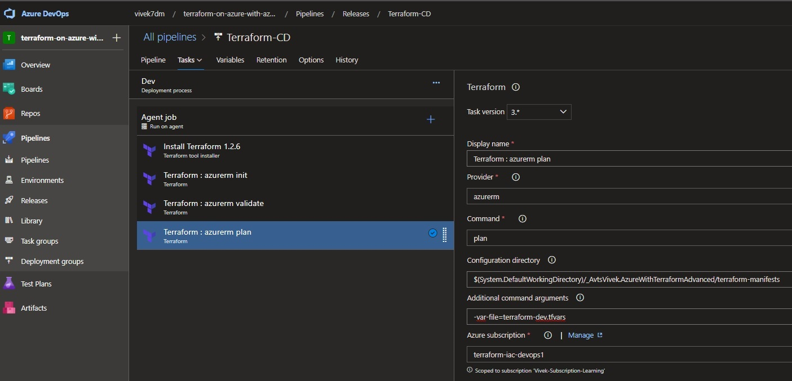

# Create a VM with a network security group

 - This example builds from [2101100-vnet-vm-nsg](https://github.com/AvtsVivek/AzureWithTerraformAdvanced/tree/main/iac/2101100-vnet-vm-nsg)

- A storage account is needed to store the terraform state files. So follow [this example to create a remote storage](https://github.com/AvtsVivek/AzureWithTerraform/tree/main/iac/1800100-provision-remote-storage)

- Azure State Storage

- Containers

## Creating service connection in azure devops.

- Go to your project, and click project settings. Then select service connections.

- Select Azure Resource Manager, then scroll down and clieck next button at the bottom.

- Select sp.

- Give a name such as **terraform-iac-devops1**. 

## Build the Release pipeline

- Release Pipeline 

- Release Pipeline2 

- Release Pipeline3 

- Release Pipeline4 

- Release Pipeline5 

- Release Pipeline6 

